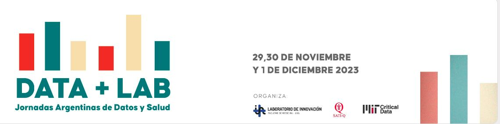

# DATATHON: DESAFÍO SATI-Q 
*SATI-Q 20 AÑOS: Analicemos juntos 2 décadas de datos de cuidados intensivos en Argentina*

## DESCRIPCIÓN:📊
En este desafío, exploraremos el potencial de la Ciencia de Datos y la Inteligencia Artificial como herramientas para identificar el perfil epidemiológico de los pacientes críticos y detectar oportunidades de mejora en la calidad de atención en las Unidades de Cuidados Intensivos de adultos y pediátricas en Argentina.
 
## OBJETIVO DEL DESAFÍO:🏆
El principal objetivo es reconocer el valor de la información generada durante los procesos de atención de los pacientes en Cuidados Intensivos y la importancia del análisis de registros de datos estandarizados y multicéntricos para generar conocimiento. Para lograrlo, se espera que los participantes puedan responder a una pregunta de investigación relevante. 

Como ejemplos de puntos de partida, pero no limitantes, compartimos las siguientes **Preguntas Inspiradoras**:

+ ¿Cuál es la evolución de los pacientes  adolescentes / adultos jóvenes en UCI o UCIP? (Menores de 20 años en UCI vs. Mayores de 14 años en UCIP)
+ ¿Cómo son los pacientes que requieren Cuidados Intermedios o tercer nivel post UCI o UCIP?  
+ ¿El reingreso a la UCI- UCIP es un factor pronóstico de mala evolución? ¿ Cuáles son sus factores de riesgo?
+ ¿El género es un factor que afecta los resultados en UCIP / UCI?
+ ¿Por Qué una mujer joven requiere Cuidados Intensivos? ¿Son distintas las causas de ingreso a las de los hombres?
+ Uso de dispositivos en UCI y UCIP: ¿Existen diferencias entre  el grado de invasión de niños y adultos críticamente enfermos?
+ Mortalidad en pacientes de bajo riesgo en UCI / UCIP : perfil epidemiológico, factores de riesgo , predicción
+ Tiempo entre ingreso al hospital e ingreso a Cuidados Intensivos : ¿influye en la mortalidad en UCI- UCIP?
+ Guardia vs Sala : ¿la procedencia afecta la evolución de los pacientes en UCI / UCIP?
+ ¿Podemos predecir la infección asociada a dispositivos en el paciente crítico?

## CONTEXTO:🏥 ⚕️
El Programa de Calidad SATI- Q es una **red multicéntrica de registro prospectivo y permanente de indicadores de calidad (Quality Benchmarking) en Unidades de Cuidados Intensivos de Argentina**, llevado adelante por la Sociedad Argentina de Terapia Intensiva (SATI). 
El Programa es voluntario y abierto para UCI y UCIP con distinto nivel de complejidad e infraestructura,  tanto del ámbito público como privado. Las Unidades participan enviando los registros de internaciones en forma anónima y estandarizada una vez por año. Para el registro de datos , disponen de un soporte informático de distribución libre, el Software SATI-Q, que permite la generación de informes automátizados y se encuentra adaptado en la practica diaria y asistencial. 

Para mas información pueden consultar la página web del Programa : https://www.satiq.net.ar/
  
Los datos que forman parte de este desafío son una muestra anonimizada y curada de la base de datos SATI-Q con registros de pacientes adultos y pediátricos internados en las Unidades participantes en el Programa.
Los registros comprenden datos de egresos entre 1-1-2002 y 31-12-2022. La base de datos pediátrica contiene egresos entre 1-1-2005 y el 31-12-2022

## PRERREQUISITOS: :hammer_and_wrench:
Todos los miembros del equipo deben haber firmado [el acuerdo de confidencialidad y uso de datos:](https://forms.gle/GqhdWrTAu9a9hVhi7)
  
Para el análisis de los datos se recomienda utilizar alguna de las siguientes plataformas:
+ R-STUDIO:  https://posit.co/download/rstudio-desktop/
+ Visual Code Studio: https://code.visualstudio.com/
+ Google Collab: https://colab.research.google.com/?hl=es

## PRESENTACIÓN DE RESULTADOS:📑
+ Se espera que cada equipo, realice una presentación de no más de 5 diapositivas, para exponer en no más de 5 minutos. Pueden descargar un *template modelo* para utilizar desde [AQUI](https://docs.google.com/presentation/d/1ifhpMzLD_AxdloG18gg8UqpvwOgekhl-/)
+ Compartir los códigos fuentes generados, dentro de la carpeta correspondiente a cada equipo. 

## ESTRUCTURA DE DATOS: :card_index:
La base de datos SATI-Q (adultos y pediátrica) está compuesta de 2 tipos de tablas: 
+ 1-tablas que contienen datos de los episodios de internaciones
+ 2-tablas que contienen códigos internos
Las distintas tablas con datos están relacionadas por **3 campos claves: TIPODNI, DNI, FECING.**
Estos campos identifican unívocamente al paciente y su internación en todo el sistema.

## REPOSITORIO DE DATOS: 📁
A los fines de este desafío se ponen a disposición las tablas que contienen datos en formato CSV (texto separado por comas). Aquellas que contienen códigos internos, además del formato CSV, se pueden consultar en los respectivos diccionarios de datos. Algunas tablas pueden estar separadas por periodos, para ser mas agiles los procesos de consultas. 

 [REPOSITORIO DE DATOS:](https://drive.google.com/drive/folders/1fTmRTHRpsRGUnIxlkTB1AN3tbH9kLnMQ?usp=drive_link)

Dentro de este *REPOSITORIO*, se disponen dos carpetas que incluyen las tablas para utilizar en este Desafío: **SATIQ-ADULTOS y SATIQ-PEDIATRICOS**. Allí mismo también encontrará el **diccionario de datos**, dentro de su respectiva carpeta.

### ÍNDICE RÁPIDO DE TABLAS EN SATI-Q: 	:pushpin:

A continuación presentamos la descripción de cada tabla / archivo CSV del *DESAFIO SATI-Q*, incluyendo los códigos internos relacionados. Estos códigos internos se presentan también en su respectiva carpeta y además están referenciados dentro del diccionario de datos.

| Tablas de Datos  | Descripción | Códigos internos |
| ------------- | ------------- | :-------------: |
| **FIVARAPA**  | Tabla principal para todos los pacientes (adultos y pediátricos). Contiene un resúmen de la evolución del paciente, datos demográficos, procedencia, uso de dispositivos, estadía y resultados. Cada fila / registro representa a una única internación. Además almacena el Puntaje APACHE II en los pacientes adultos. | *FIVARAPA_PATOLOGIA (SOLO ADULTOS), FIVARAPA_CATKNAUS (SOLO ADULTOS), FIVARAPA_COMORBIL (SOLO ADULTOS), FIVARAPA_TIPO, FIVARAPA_PROCEDENCIA, FIVARAPA_RESTRAT*|
| **FIMOTINGP**  | Contiene la categoría diagnóstica presentada al ingreso de la UCI. Se permite una sola categoría por ingreso |  |
| **FIMOTINGD**  | Contiene todos los diagnósticos presentes al ingreso de la UCIP. Se puede registrar uno o más por internación. Contiene el Diagnostico Principal (un registro por episodio), los Antecedentes (pueden haber varios registros por episodio) y Otros Diagnosticos al Ingreso (tambien pueden haber varios registros por episodio). | **(SOLO PEDIÁTRICOS)** |
| **FIMOTINGD_PRINCIPAL**  | Contiene todos los diagnósticos *PRINCIPALES* presentes al ingreso de la UCIP. Un registro por episodio. | **(SOLO ADULTOS)** |
| **FIMOTINGD_DIAGNOSTICO)**  | Contiene todos los diagnósticos *SECUNDARIOS* presentes al ingreso de la UCIP. Pueden haber varios registros por episodio. | **(SOLO ADULTOS)** |
| **FIMOTINGD_ANTECEDENTES)**  | Contiene todos los *ANTECEDENTES* presentes al ingreso de la UCIP. Pueden haber varios registros por episodio | **(SOLO ADULTOS)** |
| **FIPRACTICACVC**  | Contiene datos referentes a los catéteres venosos centrales que el paciente tuvo colocados durante su internación en la UCI. Incluye catéteres venosos centrales y catéteres arteriales. Se registra una fila por cada CVC o arterial que tuvo colocada en la UCI  | *CVC_MOTIVOS* |
| **FIPRACTICAFOLEY**  | Contiene datos referentes a las sondas vesicales que el paciente tuvo colocadas durante su internación en la UCI. Puede registrarse más de un episodio de sondaje vesical por paciente |  |
| **FIPRACTICAARM**  | Contiene datos referentes a los episodios de ventilación mecánica o apoyo respiratorio que recibió el paciente en la UCI. Incluye ventilación mecánica invasiva, no invasiva y CAFO. Se registra una fila por cada episodio de ventilación mecánica. | *ARM_COMPL, ARM_MOTIVO, ARM_UTIL* |
| **FIPROC**  | Contiene los procedimientos que se realizaron al paciente durante su internación en la UCIP. Puede registrarse más de un procedimiento por paciente, lo cual generará varias filas para el mismo registro de internación. |  |
| **FIEVOLUTI**  | Contiene los nuevos diagnósticos que presentó el paciente durante su internación en la UCIP. No estaban presentes al ingreso. Puede registrarse más de un nuevo diagnóstico por paciente, lo cual generará varias filas para el mismo paciente. |  |
| **FICOMPUTI**  | Contiene las complicaciones monitorizadas  que presentó el paciente durante su internación en la UCI (estándares de calidad monitorizados)  |  |
| **FIPIM**  | Contiene las variables necesarias para construir el puntaje de predicción de mortalidad en UCIP PIM2. El score PIM 2 se calcula a partir de la información recolectada en el momento en que el paciente ingresa en la unidad de cuidados intensivos pediátricos (UCIP) o antes de iniciar el tratamiento intensivo.  | **(SOLO PEDIÁTRICOS)** |
| **FIPIM3**  |  Contiene las variables necesarias para construir el puntaje de predicción de mortalidad en UCIP PIM3. El score PIM 3 se calcula a partir de la información recolectada en el momento en que el paciente ingresa en la unidad de cuidados intensivos pediátricos (UCIP) o antes de iniciar el tratamiento intensivo.  | **(SOLO PEDIÁTRICOS)** |
| **FIPELOD**  | Contiene las variables necesarias para construir el puntaje Pelod 1. Se trata de un puntaje para evaluar el fallo orgánico en UCIP. Se registran los valores más anomalos de cada dia. | **(SOLO PEDIÁTRICOS)** |
| **FISOFA**  | Contiene las variables necesarias para construir el puntaje SOFA. Se trata de un puntaje para evaluar el fallo orgánico en UCI. Se registran los valores más anomalos de cada dia. | **(SOLO ADULTOS)** |

## BIBLIOGRAFIA COMPLEMENTARIA 📚

**Libro**:  [Análisis Secundario de Historias Clínicas Electrónicas](https://www.hardineros.ar/analisis-secundario-de-historias-clinicas-electronicas)

*Versión traducida al español de la obra Secondary Analysis of Electronic Health Records*

Autores: Leo A Celi - MIT CRITICAL DATA; Equipo de traducción dirigido por Ariel Fernández, Maria del Pilar Arias y Juan Sebastián Osorio

## EJEMPLOS DE CÓDIGO Y MATERIAL AUXILIAR 🧰

Libreriás de Phyton más utilizadas en Ciencia de datos y documentación: 

1-Pandas [https://pandas.pydata.org/docs/user_guide/index.html ]. Libreria de manipulación y análisis de datos estructurados

2-Numpy [https://numpy.org/doc/stable/user ]. Es una libreria de Algebra Lineal (Vectores y Matrices)

3-Matplotlib [https://matplotlib.org/ ]. Libreria de visualización

4-Seaborn [https://seaborn.pydata.org/]. Libreria de visualización

5-Plotly. [https://plotly.com/python-api-reference/]. Libreria de visualización

6- Scikit learn.[https://scikit-learn.org/stable/]. Libreria para aprendizaje automático ( regresión, clasificación, clustering, preprocesamiento, etc)

En esta [Carpeta](https://drive.google.com/drive/folders/1qggMSZA0SFlRhgMZZuq3JVB8HD6a_0FL?usp=drive_link)
encontrarás ejemplos de código para realizar exploración , limpieza y manipulación de los datos y mucho más

1- DESAFIO_SATI_Q.ipynb : notebook en phyton que contiene código para leer , explorar , limpiar datos, crear variables ,etc

2- Archivo convert.js : script para unificar filas. Leer  el archivo convertjs_instrucciones.txt para ver cómo funciona. La tabla para usar en este ejemplo es FiPracticaCVC.csv

 
